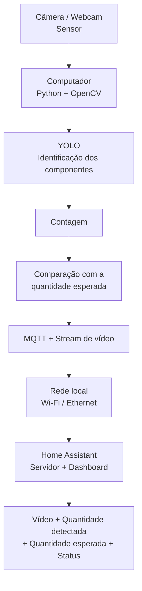

# Diagrama de Arquitetura do Projeto

## Sistema Inteligente de Identificação e Contagem de Componentes

```mermaid
flowchart LR

    %% =========================
    %% SISTEMAS DIGITAIS
    %% =========================
    subgraph SD["Sistemas Digitais / Ambiente Físico"]
        direction TB

        ILUM["Iluminação padronizada"]
        CAIXA["Caixa / Área de inspeção"]
        CAM["Câmera / Webcam<br/>Sensor visual"]

        ILUM --> CAIXA
        CAIXA --> CAM
    end

    %% =========================
    %% COMPUTADOR / PROCESSAMENTO
    %% =========================
    subgraph PROC["Computador Local - Processamento"]
        direction TB

        USB["Entrada USB<br/>Vídeo da webcam"]
        PY["Aplicação em Python"]
        CV["OpenCV<br/>Captura e tratamento da imagem"]
        YOLO["YOLO<br/>Detecção e classificação"]
        CONT["Contagem dos componentes"]
        COMP["Comparação<br/>Quantidade detectada x esperada"]
        STATUS["Geração do status<br/>OK / Quantidade incorreta"]

        USB --> PY
        PY --> CV
        CV --> YOLO
        YOLO --> CONT
        CONT --> COMP
        COMP --> STATUS
    end

    CAM -->|"USB / Vídeo"| USB

    %% =========================
    %% ENTRADAS DO USUÁRIO
    %% =========================
    subgraph ENTRADAS["Entradas de Configuração"]
        direction TB

        TIPO["Tipo de componente<br/>Ex.: Parafuso"]
        QTD["Quantidade esperada<br/>Ex.: 20"]
    end

    TIPO --> COMP
    QTD --> COMP

    %% =========================
    %% COMUNICAÇÃO / REDE
    %% =========================
    subgraph REDE["Comunicação / Rede Local"]
        direction TB

        MQTT["MQTT<br/>Dados da contagem e status"]
        STREAM["HTTP/MJPEG ou RTSP<br/>Stream de vídeo"]
        LAN["Rede local<br/>Wi-Fi / Ethernet"]
    end

    STATUS -->|"Publicação de dados"| MQTT
    YOLO -->|"Imagem com marcações"| STREAM

    MQTT --> LAN
    STREAM --> LAN

    %% =========================
    %% SISTEMAS DISTRIBUÍDOS
    %% =========================
    subgraph DIST["Sistemas Distribuídos / Serviços"]
        direction TB

        HA["Home Assistant<br/>Servidor + Dashboard"]
        DB["Banco de Dados<br/>SQLite / InfluxDB<br/>(opcional na primeira versão)"]

        HA -->|"Registro / Histórico"| DB
        DB -->|"Consulta de histórico"| HA
    end

    LAN -->|"Dados MQTT"| HA
    LAN -->|"Vídeo em tempo real"| HA

    %% =========================
    %% DASHBOARD
    %% =========================
    subgraph DASH["Dashboard / Aplicação"]
        direction TB

        VIDEO["Vídeo da câmera<br/>com marcações"]
        DET["Quantidade detectada"]
        ESP["Quantidade esperada"]
        RES["Status da inspeção<br/>OK / Incorreto"]
    end

    HA --> VIDEO
    HA --> DET
    HA --> ESP
    HA --> RES

    %% =========================
    %% ELEMENTOS NÃO UTILIZADOS
    %% =========================
    subgraph FUT["Elementos não utilizados no protótipo inicial"]
        direction TB

        MCU["Microcontrolador<br/>Não previsto"]
        ATU["Atuadores<br/>Não previstos"]
        CIR["Circuitos dedicados<br/>Não previstos além da alimentação<br/>da câmera e iluminação"]
    end

    %% Estilos
    classDef sensor fill:#e8f5e9,stroke:#2e7d32,stroke-width:2px;
    classDef processing fill:#e3f2fd,stroke:#1565c0,stroke-width:2px;
    classDef network fill:#fff3e0,stroke:#ef6c00,stroke-width:2px;
    classDef server fill:#f3e5f5,stroke:#7b1fa2,stroke-width:2px;
    classDef dashboard fill:#fce4ec,stroke:#c2185b,stroke-width:2px;
    classDef optional fill:#eeeeee,stroke:#616161,stroke-width:1px,stroke-dasharray: 5 5;

    class CAM,CAIXA,ILUM sensor;
    class USB,PY,CV,YOLO,CONT,COMP,STATUS,TIPO,QTD processing;
    class MQTT,STREAM,LAN network;
    class HA,DB server;
    class VIDEO,DET,ESP,RES dashboard;
    class MCU,ATU,CIR optional;
```

## Fluxo resumido

## Relação com as disciplinas

### Sistemas Digitais

- **Sensor:** câmera/webcam USB.
- **Entradas:** imagem da caixa, tipo de componente e quantidade esperada.
- **Circuitos:** alimentação da webcam e da iluminação do ambiente de inspeção.
- **Microcontroladores:** não previstos na versão inicial.
- **Atuadores:** não previstos na versão inicial.
- **Saídas:** imagem processada, quantidade detectada e status da inspeção.

### Sistemas Distribuídos

- **Comunicação entre dispositivos/serviços:** aplicação Python e Home Assistant.
- **Rede:** rede local via Wi-Fi ou Ethernet.
- **MQTT:** envio da quantidade detectada, quantidade esperada, tipo do componente e status.
- **HTTP/MJPEG ou RTSP:** transmissão da imagem/vídeo para o Home Assistant.
- **Servidor:** Home Assistant executado no mesmo computador, mas como serviço independente.
- **Banco de dados:** SQLite ou InfluxDB pode ser utilizado para histórico de inspeções.
- **Dashboard:** Home Assistant exibindo vídeo, marcações, contagem e status.
